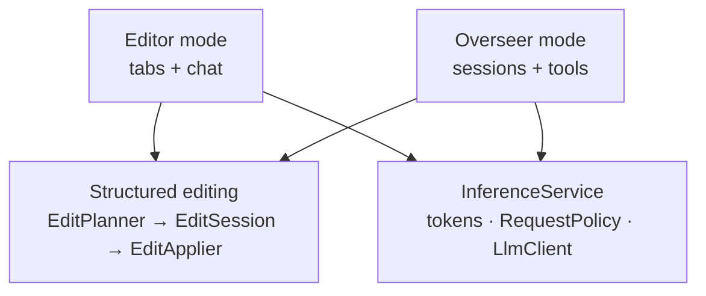
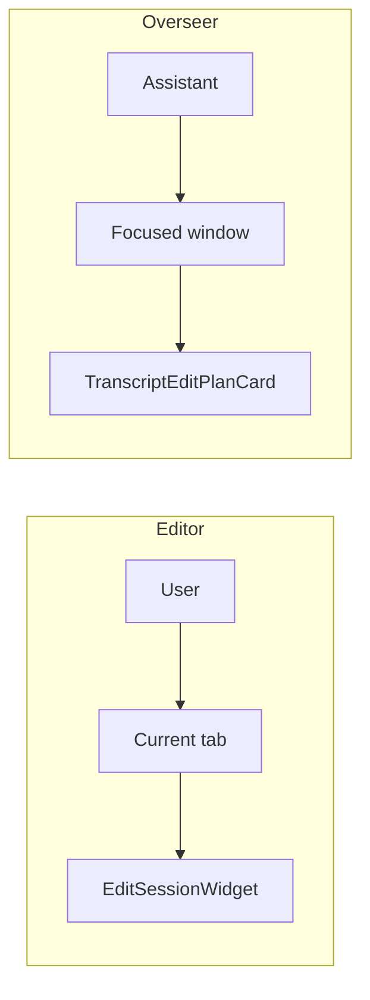

# Lore — Architecture

A Qt6/C++ markdown editor with a structured editing pipeline and a
persistent workspace assistant.

## The shape of the project

Two surfaces, one editing engine.

- **Editor mode.** Tabbed documents. A user opens a file, asks for a
  change, reviews a plan, applies it.
- **Overseer mode.** A workspace. An assistant operates on a sandboxed
  session folder, opens files into floating windows on a canvas, and
  drives the same editing engine the editor uses.

## Major features

### 1. Structured editing

An edit is a plan against a document's tree, not a text replacement.

- Files are parsed by tree-sitter. Every heading, node, and range
  becomes a **scope** with a stable ID.
- A request resolves to one or more target scopes.
- The LLM produces a **plan**: a JSON array of edit commands. Each
  names an operation (`insert`, `replace`, `replace_scope`, `delete`),
  a scope, a position, and an instruction.
- Each command is validated against the document structure before it
  runs. Invalid scopes, stale ranges, and mismatched operations are
  rejected at plan time.

Files: `EditPlanner`, `EditSession`, `EditMatcher`, `EditApplier`,
`DocumentStructure`, `DocumentNode`.

### 2. The review pipeline

Nothing is written silently.

- **Plan.** The LLM produces edit commands. They are validated.
- **Generate.** Each edit that needs content asks the LLM for it.
  Edits stream, so progress is visible.
- **Review.** The user accepts or rejects each edit individually.
- **Apply.** Accepted edits are written to the document, then to disk.

Files: `EditSessionWidget`, `TranscriptEditPlanCard`, `PendingEdit`.

### 3. Request-scoped LLM dispatch

Many consumers, one LLM client, no interference.

- `InferenceService` issues requests and returns a `QUuid` token.
- Every `llm*` signal carries the token as its first parameter.
- Consumers filter on their own token and ignore everything else.
- `RequestPolicy` decides what happens when a new request arrives
  while another is active: abort the old one, or queue behind it.

Files: `InferenceService`, `LlmClient`.

### 4. Overseer

A persistent assistant working inside a sandboxed session folder.

- Each session has its own folder: `memory.md`, `transcript.md`,
  `overview.md`, `output/`.
- The assistant has **tools** — small classes with a name, a JSON
  schema, and an `execute` method. Tools read, write, and list files
  inside `output/`. They never touch the user's real notes.
- Real notes can be read through `read_notes_file`, and edited through
  `edit_note`, which copies into the session first and requires
  explicit promotion to write back.

Files: `OverseerWidget`, `OverseerToolRegistry`, `OverseerTools.cpp`,
`OverseerSession`, `OverseerStorage`.

### 5. The Workstation

Files open as floating or tiled windows on a canvas, not as tabs.

- Tiled windows reflow into a grid. Any window can be floated.
- The layout persists per session in `workstation.json`.
- A file watcher surfaces on-disk conflicts with reload / keep /
  overwrite.
- Windows have a header (title, status pill, close) and a context menu
  for everything else.

Files: `Workstation`, `WorkstationWindow`, `TextWidget`, `TextDocument`,
`DocumentManager`.

### 6. The transcript

Every event in a session is an ordered `TranscriptEvent`.

- Types: user message, assistant message, tool call, tool result,
  memory proposal, edit plan, stage, promotion, error, notice.
- `TranscriptStore` owns the list and persists it.
- `TranscriptPanel` renders cards.
- A ribbon maps the whole transcript to a navigable strip.
- Filters narrow which event types are shown.

Files: `TranscriptStore`, `TranscriptPanel`, `TranscriptEventCard`,
`TranscriptRibbon`.

### 7. Memory

Two scopes, one mechanism.

- **Global memory** lives at `Overseer/memory.md`. Standing facts the
  assistant knows in every session.
- **Session memory** lives at `Overseer/Sessions/<name>/memory.md`.
  Facts scoped to the current work.
- The assistant proposes facts. The user accepts or rejects them.
  Accepted facts are appended to the appropriate file.

Files: `MemoryPanel`, `MemoryProposalCard`, `OverseerStorage`.

### 8. Overview

A per-session list of referenced notes from the user's real library.

- References are relative paths. Missing files are struck through and
  reported.
- Files can be dragged from the file tree into the overview.
- The assistant sees the overview on every turn.

Files: `OverviewPanel`, `OverseerOverviewEditor`.

## How the features connect

Three layers:

- **Structured editing** is the bottom of the app. Both surfaces sit on
  it.
- **The surfaces** are the editor and the Overseer. They do not talk to
  each other. They both call the engine.
- **InferenceService** is shared. Every LLM call goes through it.

## How the surfaces differ

They differ in who initiates a scoped edit and where the review happens.

The engine that resolves, plans, generates, validates, and applies is
identical in both.

## Where to start reading

1. `InferenceService.h` — the contract every LLM consumer uses.
2. `EditPlanner.cpp` — how a request becomes a plan.
3. `EditSession.cpp` — how a plan becomes edits, and how they apply.
4. `OverseerWidget.cpp` — how the assistant drives tools, memory, and
   scoped edits.
5. `Workstation.cpp` — how files are shown and laid out.
